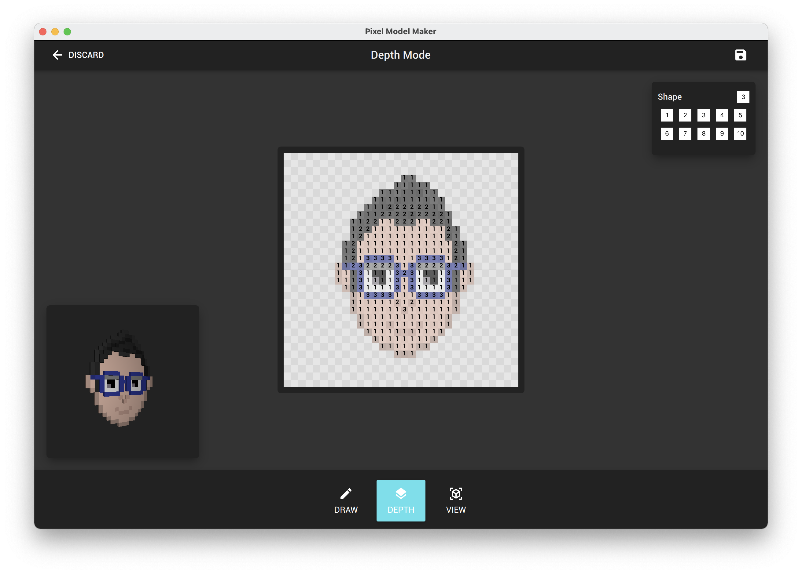
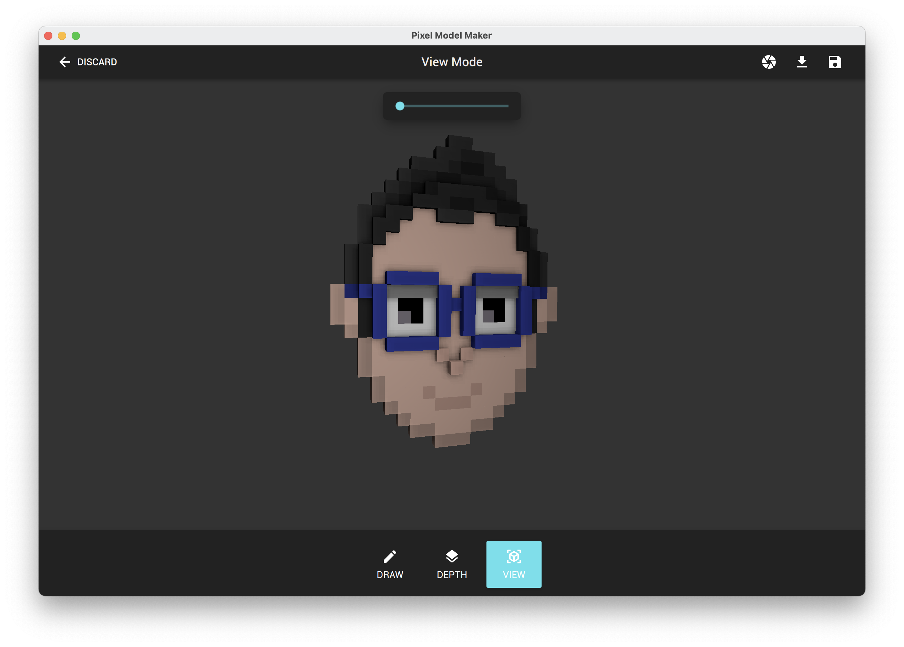

# Pixel Model Maker
PixelModelMaker is an opensource clone of [KenShape](https://tools.kenney.nl/kenshape/) from [Kenny](https://kenney.nl/).

# Features

* ✅ Draw Pixels
* ✅ Draw Depth
* ✅ Interactive 3d Model Viewer
* ✅ 3d Model Miniview
* ✅ Open & Save
* ✅ Export Image
* ✅ Export 3D
* ✅ More Shapes
* ✅ Depth Scale Slider
* ✅ Depth Palette

## Todo

* Shape & Color Picker
* Rotate Shapes
* Custom Color Palette
* Model Optimization
* Automatic Depth

# Dependencies
* Qt6

# Deployment Packaging
## MacOS
```bash
macdeployqt PixelModelMaker.app -qmldir=$PROJECT_DIR/ui/ -qmlimport=$PROJECT_DIR/ui/imports/
```

## Windows
```bash
windeployqt --release --qmldir %PROJECT_DIR%\ui  --qmlimport %PROJECT_DIR%\ui\imports PixelModelMaker.exe
```
# Screenshots

Screen | Image
-------|:----:
Welcome| 
Draw   | 
Depth  | 
3D View| 
Exported to Blender| 