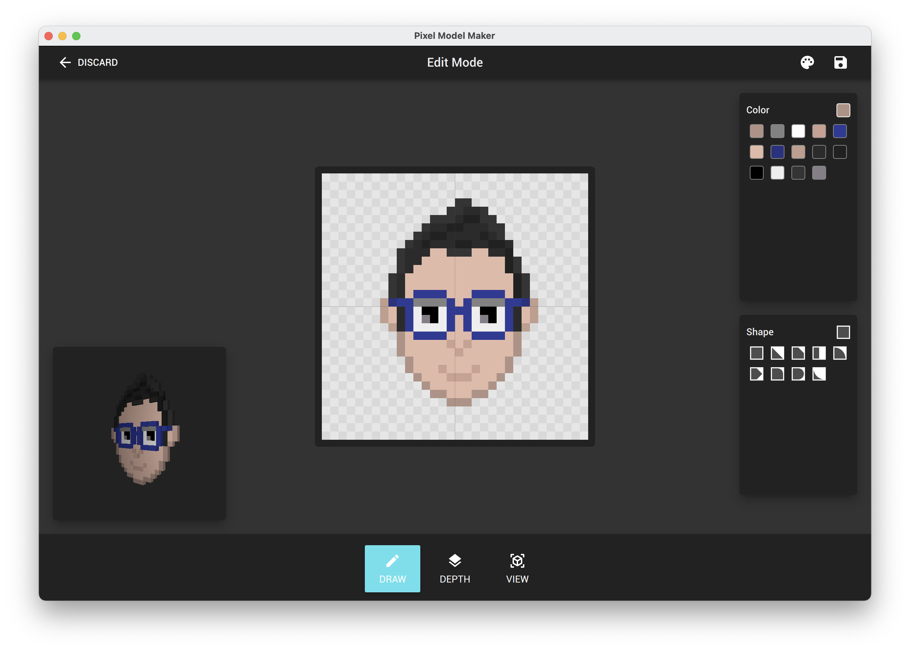

# Pixel Model Maker
PixelModelMaker allows you to use simple forms to draw on a 2d canvas. You can then raise each pixel's depth and see the outcome in 3d. The image and 3d model can be exported to continue using other softwares.

<a href="https://www.producthunt.com/posts/pixel-model-maker?utm_source=badge-featured&utm_medium=badge&utm_souce=badge-pixel-model-maker" target="_blank"></a>

# Sample


# Downloads
Download for [Windows](https://github.com/zaghaghi/pixel-model-maker/releases) and [MacOS](https://github.com/zaghaghi/pixel-model-maker/releases)

# Known Issues
If you get a blank screen on Windows, try .vbs files for different graphic drivers and find the best one works for you.

# Features

* ✅ Draw Pixels
* ✅ Draw Depth
* ✅ Interactive 3d Model Viewer
* ✅ 3d Model Miniview
* ✅ Open & Save
* ✅ Export Image
* ✅ Export 3D
* ✅ More Shapes
* ✅ Depth Scale Slider
* ✅ Depth Palette
* ✅ Shape & Color Picker
* ✅ Rotate Shapes
* ✅ Custom Color Palette
* ✅ Open Image
* ✅ Help Pane

## Todo
* Undo and Redo
* Model Optimization
* Automatic Depth

# Dependencies
* Qt6

# Deployment Packaging
## MacOS
```bash
macdeployqt PixelModelMaker.app -qmldir=$PROJECT_DIR/ui/ -qmlimport=$PROJECT_DIR/ui/imports/ -dmg
```

## Windows
```bash
windeployqt --release --qmldir %PROJECT_DIR%\ui  --qmlimport %PROJECT_DIR%\ui\imports PixelModelMaker.exe
```

# Help
## Draw Mode Canvas
Action      | Description
------------|------------
Click       | Paste Shape & Color
Click + Shift | Paste Color Only
Click + Ctrl  | Paste Shape Only
RightClick  | Delete Shape & Color
MiddleClick | Pick Shape & Color
MiddleClick + Shift | Pick Color Only
MiddleClick + Ctrl | Pick Shape Only
Mouse Wheel | Rotate Shape

# Screenshots

Screen | Image
-------|:----:
Welcome| 
Draw   | 
Depth  | 
3D View| 
Exported to Blender| 

# Input Viewer
If you want to enable input viewer to show the mouse actions pass `-input-pane` as command line argument.

# License
PixelModelMaker uses Qt6 Open-source license, so its license is LGPL. 
Contents that is created with this tool is not copy righted. 
