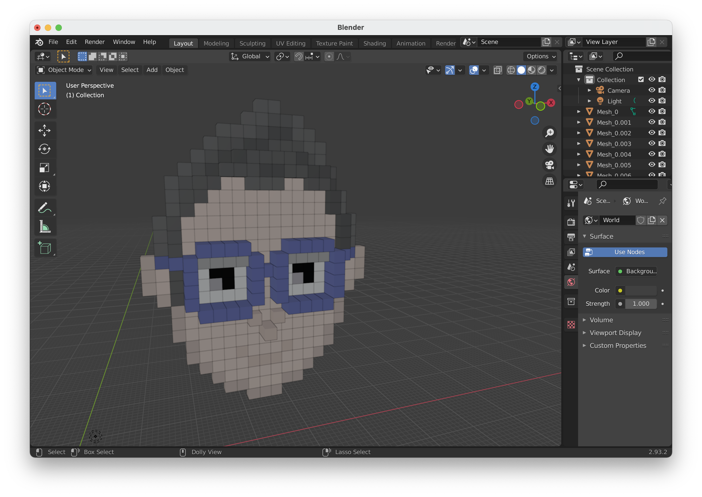

# Pixel Model Maker
PixelModelMaker is an opensource clone of [KenShape](https://tools.kenney.nl/kenshape/) from [Kenny](https://kenney.nl/).

# Features

* ✅ Draw Pixels
* ✅ Draw Depth
* ✅ Interactive 3d Model Viewer
* ✅ 3d Model Miniview
* ✅ Open & Save
* ✅ Export Image
* ✅ Export 3D

## Todo
* More Shapes
* Custom Color Palette
* Model Optimization
* Automatic Depth

# Dependencies
* Qt6

# Screenshots

Screen | Image
-------|:----:
Welcome| 
Draw   | 
Depth  | 
3D View| 
Exported to Blender| 